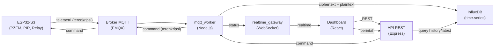
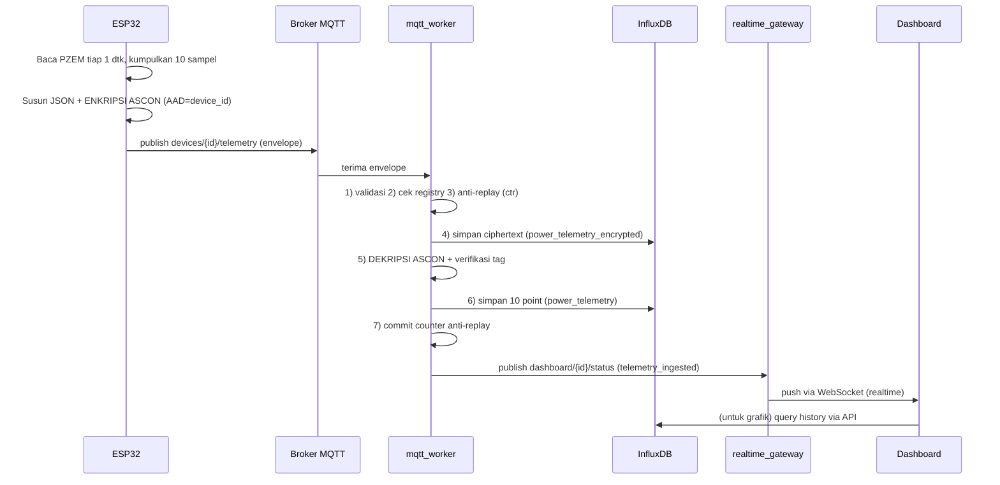
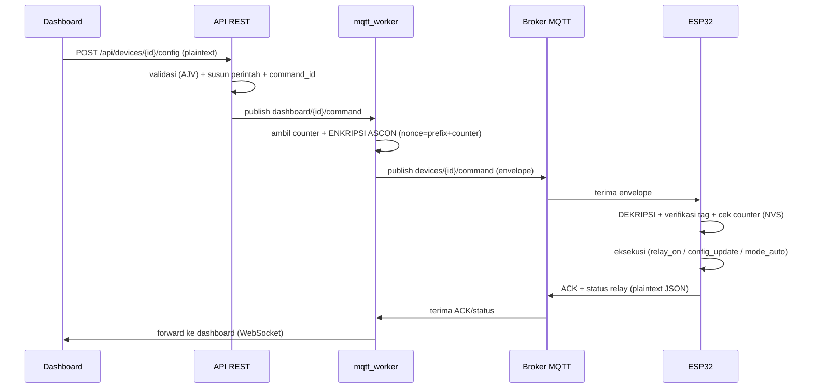

# Alur Data Monitoring & Kontrol — Enkripsi/Dekripsi (VoltGuard)

Dokumen ini menjelaskan **alur lengkap data monitoring dan kontrol** pada sistem
smart socket, termasuk proses **enkripsi/dekripsi ASCON-AEAD128**, **bentuk data**
di tiap tahap, dan **letak kode** (file · fungsi) untuk setiap proses.

> Ringkas: yang **dienkripsi ASCON** adalah **telemetri** (device → server) dan
> **perintah** (server → device). **ACK** dan **status** relay/konektivitas dikirim
> sebagai **plaintext JSON** (pesan kontrol non-sensitif).

---

## 1. Arsitektur & Jalur Data



| Komponen | Peran |
|---|---|
| ESP32-S3 | Baca sensor (PZEM-004T), kontrol relay, PIR, enkripsi telemetri, dekripsi perintah |
| EMQX | Broker MQTT |
| mqtt_worker | Dekripsi telemetri, validasi, anti-replay, simpan ke InfluxDB, enkripsi perintah |
| InfluxDB | Penyimpanan time-series (ciphertext arsip + plaintext hasil dekripsi) |
| API | REST untuk query data & terima perintah dari dashboard |
| realtime_gateway | Jembatan MQTT → WebSocket (update realtime) |
| Dashboard | Antarmuka web (React) |

---

## 2. Alur MONITORING (sensor → website)

### Penjelasan proses



**7 langkah `mqtt_worker`:** (1) validasi struktur envelope → (2) cek device dikenal →
(3) anti-replay: `ctr` harus > terakhir → (4) arsip ciphertext ke `power_telemetry_encrypted` →
(5) dekripsi + verifikasi `tag` → (6) validasi plaintext, pecah batch jadi 10 point ke
`power_telemetry` → (7) commit counter + publish status ke dashboard.

### Bentuk data

**Plaintext sebelum dienkripsi (di ESP32):**
```json
{
  "device_id": "smart_socket",
  "samples": [
    { "ts": 1780900000000, "v": 218.9, "i": 0.047, "p": 4.66, "e": 421 },
    { "ts": 1780900001000, "v": 217.8, "i": 0.051, "p": 4.70, "e": 421 }
    // ... 10 sampel — ts=epoch ms, v=Volt, i=Ampere, p=Watt, e=Wh
  ]
}
```

**Envelope terenkripsi (yang dikirim via MQTT):**
```json
{
  "enc": 1,
  "device_id": "smart_socket",
  "kid": 1,
  "ctr": 10482,
  "nonce": "a1b2c3d4e5f6a7b8c9d0e1f2a3b4c5d6",
  "tag":   "9f8e7d6c5b4a39281706f5e4d3c2b1a0",
  "cipher": "3c5a9f...e2"
}
```
- **AAD = `device_id`** → mengikat ciphertext ke perangkat tertentu.
- **`tag`** → bukti keaslian + keutuhan (1 bit berubah → dekripsi ditolak).
- **`ctr`** → counter anti-replay (monoton naik).

### Letak kode

| # | Tahap | File · fungsi |
|---|---|---|
| 1 | Baca sensor PZEM | [pzem004t.c](../firmware/core/components/pzem004t/pzem004t.c) · `pzem_read_data()` |
| 1 | Loop utama | [app_main.c](../firmware/devices/smart_socket/app_main.c) · `app_main()` while-loop |
| 2 | Susun JSON sampel | [telemetry.c](../firmware/core/components/telemetry/telemetry.c) · `telemetry_build_power_json()` |
| 3 | **Enkripsi ASCON (device)** | [ascon.c](../firmware/core/components/ascon_crypto/ascon.c) · `ascon_encrypt_telemetry()` |
| 3 | Nonce + counter TX | [ascon.c](../firmware/core/components/ascon_crypto/ascon.c) · `ascon_generate_nonce()` |
| 4 | Publish MQTT telemetri | [mqtt_client.c](../firmware/core/components/mqtt_client/mqtt_client.c) · `mqtt_app_publish_telemetry()` |
| 5 | Worker: terima + 7 langkah | [telemetryHandler.js](../backend/mqtt_worker/src/handlers/telemetryHandler.js) · `handleTelemetryMessage()` |
| 5 | Cek anti-replay | [replayGuard.js](../backend/mqtt_worker/src/security/replayGuard.js) · `check()` / `commit()` |
| 5 | **Dekripsi ASCON (server)** | [asconAead128.js](../backend/mqtt_worker/src/handlers/asconAead128.js) · `decryptTelemetryEnvelope()` |
| 5 | Simpan ke InfluxDB | [influxWriter.js](../backend/mqtt_worker/src/influx_writer/influxWriter.js) · `writeEncryptedEnvelope()`, `writeTelemetrySample()` |
| 5 | Forward status dashboard | [telemetryHandler.js](../backend/mqtt_worker/src/handlers/telemetryHandler.js) · `publishDashboardStatus()` |
| 6 | Broker → WebSocket | [websocket_server.js](../backend/realtime_gateway/websocket_server.js) |
| 7 | API query history/latest | [influxRepo.js](../backend/api/src/repositories/influxRepo.js) · `getTelemetryHistory()`, `getLatestTelemetry()` |
| 7 | WS client (browser) | [ws.ts](../frontend/dashboard/src/services/ws.ts) |
| 7 | Update state realtime | [useDevice.ts](../frontend/dashboard/src/hooks/useDevice.ts) · [useDevices.ts](../frontend/dashboard/src/hooks/useDevices.ts) |
| 7 | Konversi data → UI | [adapters.ts](../frontend/dashboard/src/lib/adapters.ts) · `adaptDevice()`, `adaptHistoryPoint()` |
| 7 | Tampilan grafik/tile | [DeviceDetailPage.tsx](../frontend/dashboard/src/pages/DeviceDetailPage.tsx) |

---

## 3. Alur KONTROL (website → perangkat)

### Penjelasan proses



### Bentuk data

**Request dari dashboard (plaintext, divalidasi AJV):**
```json
{ "pir_timeout_sec": 600, "power_threshold_w": 10 }
```

**Plaintext perintah sebelum dienkripsi:**
```json
{ "command": "config_update:pir=600,thr=10" }
```
> Contoh `command` lain: `relay_on`, `relay_off`, `mode_auto`, `mode_manual`, `ping`.

**Envelope perintah terenkripsi (server → device):**
```json
{
  "enc": 1,
  "device_id": "smart_socket",
  "kid": 1,
  "ctr": 37,
  "nonce": "<8 byte prefix><8 byte counter BE>",
  "tag": "...32hex",
  "cipher": "...hex",
  "command_id": "cmd-7f3a"
}
```
- **AAD = kosong** (kontrak khusus perintah).
- **Nonce = prefix 8 byte + counter 8 byte (big-endian)** → unik tiap perintah.

**Balasan dari ESP32 (plaintext JSON):**
```json
// ACK -> devices/{id}/ack
{ "device_id":"smart_socket", "command_id":"cmd-7f3a",
  "status":"ok", "message":"konfigurasi auto-control diperbarui" }

// Status relay -> devices/{id}/relay/status
{ "device_id":"smart_socket", "status_type":"relay", "status":"ON" }
```

### Letak kode

| # | Tahap | File · fungsi |
|---|---|---|
| 1 | User klik (kirim perintah) | [useCommand.ts](../frontend/dashboard/src/hooks/useCommand.ts) · [usePatchDevice.ts](../frontend/dashboard/src/hooks/usePatchDevice.ts) |
| 1 | Validasi body REST | [api_schemas.js](../backend/common/schemas/api_schemas.js) (`controlCommand`, `configUpdate`, `modeUpdate`) |
| 2 | Route + controller | [routes/devices.js](../backend/api/src/routes/devices.js) · [commandController.js](../backend/api/src/controllers/commandController.js) |
| 2 | Susun perintah + counter | [commandService.js](../backend/api/src/services/commandService.js) · `sendConfig()` / `sendCommand()` |
| 2 | Publish ke worker | [mqttPublisher.js](../backend/api/src/repositories/mqttPublisher.js) |
| 3 | **Enkripsi ASCON command** | [asconAead128.js](../backend/mqtt_worker/src/handlers/asconAead128.js) · `encryptCommandEnvelope()` |
| 3 | Counter command (anti-replay) | [commandCounter.js](../backend/mqtt_worker/src/security/commandCounter.js) |
| 3 | Handler command worker | [commandHandler.js](../backend/mqtt_worker/src/handlers/commandHandler.js) |
| 4 | Device terima + callback | [app_main.c](../firmware/devices/smart_socket/app_main.c) · `mqtt_command_callback()` |
| 4 | **Dekripsi ASCON command** | [ascon.c](../firmware/core/components/ascon_crypto/ascon.c) · `ascon_decrypt_command()` |
| 4 | Eksekusi (relay/config/mode) | [app_main.c](../firmware/devices/smart_socket/app_main.c) (dalam `mqtt_command_callback`) |
| 5 | Kirim ACK | [mqtt_client.c](../firmware/core/components/mqtt_client/mqtt_client.c) · `mqtt_app_publish_ack()` |
| 5 | Kirim status relay | [mqtt_client.c](../firmware/core/components/mqtt_client/mqtt_client.c) · `mqtt_app_publish_relay_status()` |
| 6 | Worker proses ACK/status | [deviceEventHandler.js](../backend/mqtt_worker/src/handlers/deviceEventHandler.js) |

---

## 4. Inti Enkripsi/Dekripsi — ASCON-AEAD128

| Parameter | Nilai |
|---|---|
| Algoritma | **ASCON-AEAD128** (standar **NIST SP 800-232**, final 2025) |
| Kunci | 128-bit (16 byte), dipilih via `kid` (keyring firmware = backend) |
| Nonce (Npub) | 128-bit (16 byte) |
| Tag autentikasi | 128-bit (16 byte) |
| Rate / ronde | 16 byte; p^a = 12, p^b = 8 |
| AAD | telemetri = `device_id` · perintah = kosong |

**AEAD memberi dua jaminan sekaligus:**
- **Kerahasiaan** → isi (daya, perintah) menjadi `cipher`, tak terbaca penyadap.
- **Keaslian + keutuhan** → `tag`. Diubah 1 bit → dekripsi mengembalikan `null` → ditolak.

**Anti-replay (`ctr`):** counter monoton per device. Server & ESP32 menyimpan nilai
terakhir; paket dengan `ctr` lama otomatis ditolak (serangan rekam-dan-kirim-ulang gagal).
Di ESP32 counter disimpan di **NVS** agar tetap monoton walau reboot.

### Letak kode inti kripto

| Bagian | Firmware (ESP32, C) | Backend (Node.js) |
|---|---|---|
| Implementasi algoritma | [ascon.c](../firmware/core/components/ascon_crypto/ascon.c) | [asconAead128.js](../backend/mqtt_worker/src/handlers/asconAead128.js) |
| Enkripsi telemetri | `ascon_encrypt_telemetry()` | (dekripsi) `decryptTelemetryEnvelope()` |
| Dekripsi perintah | `ascon_decrypt_command()` | (enkripsi) `encryptCommandEnvelope()` |
| Primitif AEAD | `asconPermute`, init/absorb/finalize | `crypto_aead_encrypt` / `crypto_aead_decrypt` |
| Counter anti-replay (TX/RX) | `ascon_generate_nonce`, `ascon_set/get_tx_counter` | [replayGuard.js](../backend/mqtt_worker/src/security/replayGuard.js), [commandCounter.js](../backend/mqtt_worker/src/security/commandCounter.js) |
| Persistensi counter (tahan reboot) | NVS: `ascon_ctr_nvs_load_and_reserve()` di [app_main.c](../firmware/devices/smart_socket/app_main.c) | file state: [stateFile.js](../backend/mqtt_worker/src/security/stateFile.js) |
| Uji KAT (1089/1089 PASS) | [tests/ascon128aead/](../tests/ascon128aead/) | — |

---

## 5. Ringkasan Bentuk Data per Tahap

| Tahap | Lokasi | Bentuk data |
|---|---|---|
| Sampel sensor | ESP32 | plaintext JSON (10 sampel `ts,v,i,p,e`) |
| Kirim telemetri | MQTT | **envelope terenkripsi** (`enc,kid,ctr,nonce,tag,cipher`) |
| Arsip | InfluxDB `power_telemetry_encrypted` | ciphertext + metadata |
| Hasil dekripsi | InfluxDB `power_telemetry` | 10 point (`voltage_v,current_a,power_w,...`) |
| Perintah | MQTT | **envelope terenkripsi** + `command_id` |
| Balasan | MQTT | ACK & status (**plaintext JSON**) |
| Ke browser | WebSocket / REST | JSON ringkas untuk UI |

---

## 6. Kontrak Data Bersama (firmware ↔ backend)

| Hal | File |
|---|---|
| Bentuk envelope/ack/status (JSON Schema) | [payload_schema.json](../firmware/shared_protocol/payload_schema.json) |
| Daftar topik MQTT | [topics.js](../backend/common/constants/topics.js) |
| Skema measurement InfluxDB | [schema.md](../database/influxdb/schema.md) |
| Profil device (ID, default PIR/threshold) | [device_profile.h](../firmware/devices/smart_socket/device_profile.h) |

---

## 7. Topik MQTT

| Topik | Arah | Isi | Enkripsi |
|---|---|---|---|
| `devices/{id}/telemetry` | device → server | telemetri batch | ✅ ASCON |
| `devices/{id}/command` | server → device | perintah | ✅ ASCON |
| `devices/{id}/ack` | device → server | konfirmasi perintah | plaintext |
| `devices/{id}/relay/status` | device → server | status relay ON/OFF | plaintext |
| `devices/{id}/status` | device → server | online/offline (LWT) | plaintext |
| `dashboard/devices/{id}/command` | API → worker | perintah (pra-enkripsi) | plaintext (jaringan internal) |
| `dashboard/devices/{id}/status` | worker → dashboard | status untuk UI | plaintext (jaringan internal) |
